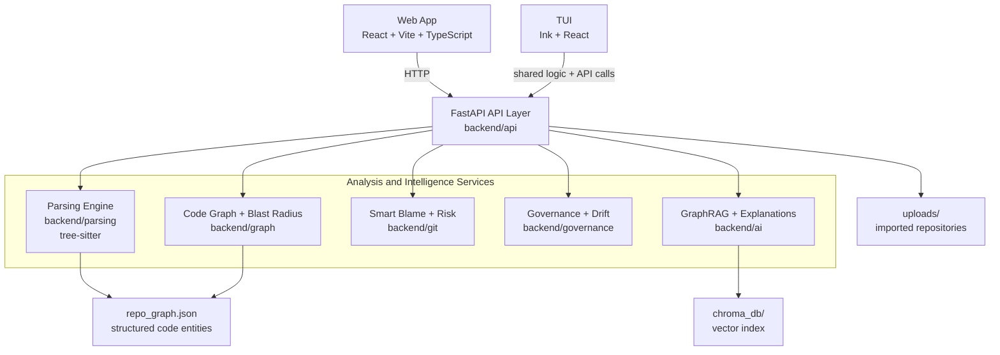

# Synapse

Synapse is a full-stack code intelligence platform that turns any repository into an explorable knowledge system. It combines static code analysis, dependency graphing, git-based expertise mapping, architecture governance, and AI-assisted reasoning so teams can understand impact before they ship changes.

Built for hackathon submission, the current project is a complete, runnable product with a React frontend, FastAPI backend, a terminal UI, repository ingestion flow, interactive analysis screens, and GraphRAG-powered codebase Q and A.

## Quick Navigation

- [Why Synapse Exists](#why-synapse-exists)
- [Core Product Features](#core-product-features)
- [Architecture Overview](#architecture-overview)
- [Tech Stack](#tech-stack)
- [Repository Structure](#repository-structure)
- [Running The Project Locally](#running-the-project-locally)
- [UI Preview](#ui-preview)
- [API Highlights](#api-highlights)
- [Testing](#testing)

## Why Synapse Exists

Modern teams move fast, but code understanding does not scale linearly with team size. The result is a repeated set of failures:

- Engineers change code without understanding downstream impact.
- Critical knowledge stays trapped with a small number of people.
- Architecture drifts silently until it becomes expensive to reverse.
- New contributors struggle to build context quickly.

Synapse addresses those problems with one workflow:

1. Ingest a repository from GitHub or a ZIP upload.
2. Parse source code into entities and relationships.
3. Build a dependency graph and risk model.
4. Analyze git history to identify true experts.
5. Validate architectural boundaries and drift.
6. Layer AI reasoning on top of structured graph context.

## Core Product Features

### 1. Repository Ingestion

- Upload a zipped codebase.
- Clone a GitHub repository directly from the UI.
- Parse and rebuild the knowledge graph in the background.
- Track analysis state with live progress via the upload status API.

### 2. Dependency Graph and Blast Radius Analysis

- Extract entities such as functions, classes, imports, and relationships.
- Build repository-wide dependency graphs.
- Visualize graph structure at directory, file, and entity levels.
- Calculate blast radius for a selected function.
- Generate AI explanations for impact and risk.

### 3. Smart Blame and Knowledge Risk

- Identify the most likely expert for any file.
- Go beyond last-commit ownership by weighting multiple contribution signals.
- Surface bus factor risk areas.
- Show expertise heatmaps and knowledge gaps.

### 4. Architectural Governance

- Validate repositories against layered architecture rules.
- Detect boundary violations between modules and layers.
- Report architecture drift indicators over time.
- Present issues and layer summaries in the frontend.

### 5. AI Mentor

- Ask questions about the indexed codebase in natural language.
- Combine graph context with vector search for better answers.
- Use AI to explain blast radius findings and system structure.
- Support a private, low-friction learning workflow for developers.

### 6. Full-Stack Product Experience

- Authentication-enabled React frontend.
- Ink-based terminal UI for keyboard-first interaction.
- Dashboard for graph, risk, and governance health.
- Dedicated pages for blast radius, Smart Blame, governance, and AI mentor.
- FastAPI backend with documented endpoints via Swagger.

## Product Walkthrough

The intended user flow is:

1. Sign in from the landing page.
2. Import a repository by GitHub URL or ZIP upload.
3. Wait while Synapse clones or extracts, parses, and builds the graph.
4. Open the dashboard to review repository scale, risk areas, and violations.
5. Use Blast Radius to inspect the impact of a function change.
6. Use Smart Blame to find the right engineer to consult.
7. Use Governance to inspect boundary violations and drift.
8. Use AI Mentor to ask questions about the repository in plain English.

## What Makes It Different

Synapse is not just a code visualizer and not just a chatbot.

- Graph-first: repository structure is represented as explicit entities and relationships.
- Human-aware: git history becomes expertise intelligence, not just blame output.
- Governance-aware: architectural rules are validated as part of code understanding.
- AI-grounded: model responses are anchored in indexed repository context.
- Demo-ready: the project already includes both the analysis engine and the usable UI.

## Architecture Overview



### Architecture Notes

- `backend/api` orchestrates ingestion, analysis, and query endpoints.
- `backend/parsing` and `backend/graph` build the structural model used across features.
- `backend/git` powers expertise, bus-factor, and knowledge-risk views.
- `backend/governance` enforces layer boundaries and tracks architecture drift.
- `backend/ai` combines graph context plus vector retrieval for grounded responses.

## Tech Stack

### Frontend

- React 19
- TypeScript
- Vite
- React Router
- TanStack Query
- Framer Motion
- Recharts
- Firebase Authentication

### Terminal UI

- Ink
- React
- Chalk
- tsx

### Backend

- FastAPI
- Python 3.10+
- tree-sitter
- NetworkX
- GitPython
- Pydantic

### AI and Retrieval

- ChromaDB
- LangChain
- sentence-transformers
- Google Generative AI integration
- Optional AWS/OpenSearch abstractions for future deployment paths

## Repository Structure

```text
Node-Zero-Synapse/
├── backend/
│   ├── ai/                  AI, embeddings, prompts, GraphRAG pipeline
│   ├── api/                 FastAPI application and endpoints
│   ├── git/                 Smart Blame and git-backed risk analysis
│   ├── governance/          rule engine, validation, and drift detection
│   ├── graph/               dependency graph construction and traversal
│   ├── parsing/             AST parsing and entity extraction
│   ├── ingestion/           ingestion handlers
│   └── tests/               backend tests
├── frontend/
│   ├── src/pages/           landing, dashboard, blast radius, mentor, governance
│   ├── src/components/      visualization and UI components
│   ├── src/lib/             API client, hooks, auth, utilities
│   └── tests/               frontend tests
├── packages/
│   ├── core/                shared logic used across app surfaces
│   └── tui/                 terminal user interface for Synapse
├── scripts/
│   └── index_codebase.py    offline indexing into ChromaDB
├── uploads/                 uploaded or cloned repositories
├── dummy_repo/              sample repository for testing/demo use
├── design.md                system design reference
├── requirements.md          product requirements reference
└── RUN_PROJECT.md           alternate run guide
```

## Running The Project Locally

### Prerequisites

- Python 3.10 or newer
- Node.js 18 or newer
- Git

### 1. Backend Setup

```bash
python -m venv .venv
.venv\Scripts\activate
pip install -r requirements.txt
```

Optional environment variables:

```env
GOOGLE_API_KEY=your_key_here
SYNAPSE_DISABLE_AI=0
CORS_ALLOW_ORIGINS=http://localhost:5173,http://127.0.0.1:5173
```

Notes:

- `GOOGLE_API_KEY` is needed for AI Q and A when the RAG pipeline is enabled.
- Set `SYNAPSE_DISABLE_AI=1` if you want to run the platform without loading AI dependencies.
- The backend defaults to analyzing the bundled `dummy_repo` until a new repository is uploaded.

Start the backend:

```bash
python -m uvicorn backend.api.main:app --reload
```

Backend URLs:

- API: `http://127.0.0.1:8000`
- Swagger UI: `http://127.0.0.1:8000/docs`

### 2. Frontend Setup

```bash
cd frontend
npm install
npm run dev
```

Optional frontend environment variable:

```env
VITE_API_URL=http://127.0.0.1:8000
```

The frontend defaults to `http://127.0.0.1:8000` if no backend URL is provided.

### 3. TUI Setup

```bash
cd packages/tui
npm install
npm run dev
```

The terminal UI is implemented with Ink and is useful for keyboard-first demos or lightweight local interaction.

### 4. Open The App

- Frontend: `http://localhost:5173`
- Backend docs: `http://127.0.0.1:8000/docs`
- TUI: run from `packages/tui` with `npm run dev`

## Data and Indexing Flow

Synapse uses two persistent generated artifacts during local development:

1. `repo_graph.json`
   This stores the structured repository entities extracted from parsing.

2. `chroma_db/`
   This stores the local vector index used by the AI retrieval layer.

Typical generation flow:

```bash
python -m backend.parsing.parser .
python scripts/index_codebase.py
```

The UI can also rebuild analysis data automatically through the upload endpoints.

## Additional Interface

### Terminal UI

- Provides a terminal-first Synapse experience alongside the web app.
- Lives in `packages/tui` and uses Ink with React.
- Complements the frontend for demos, local exploration, and keyboard-driven usage.

## Main Screens

### Landing Page

- Authentication entry point.
- ZIP upload and GitHub import.
- Starts repository analysis workflow.

### Dashboard

- Total nodes and edges.
- Bus factor risk areas.
- Architecture violations and warnings.
- Heatmap and drift-oriented summary widgets.

### Blast Radius

- Explore dependency impact from a selected function.
- Inspect affected functions and risk implications.
- Use AI-generated explanation for deeper interpretation.

### Smart Blame

- Search by file path.
- Find the primary expert and secondary experts.
- Review bus factor and expertise score factors.

### Governance

- Inspect layer definitions.
- Review active violations and warnings.
- Validate architecture boundaries.

### AI Mentor

- Ask free-form questions about the indexed codebase.
- Receive graph- and retrieval-aware answers.

## API Highlights

### Core Analysis

- `GET /`
- `GET /graph`
- `GET /graph/condensed`
- `GET /blast-radius/{function_name}`
- `GET /blast-radius/{function_name}/explain`
- `GET /git-risk/{file_path}`

### Smart Blame

- `GET /blame/expert/{file_path}`
- `GET /blame/heatmap`
- `GET /blame/bus-factor`
- `GET /blame/gaps`
- `GET /blame/developer/{email}`

### Governance

- `GET /governance/validate`
- `GET /governance/violations`
- `GET /governance/drift`
- `GET /governance/layers`

### AI

- `POST /ai/index`
- `GET /ai/ask`

### Repository Import

- `POST /upload/folder`
- `POST /upload/github`
- `GET /upload/status`

## Smart Blame Scoring Model

The expertise model blends several signals rather than relying on raw blame lines.

| Factor | Weight |
|--------|--------|
| commit_frequency | 0.15 |
| lines_changed | 0.10 |
| refactor_depth | 0.25 |
| architectural_changes | 0.20 |
| bug_fixes | 0.15 |
| recency | 0.10 |
| code_review_participation | 0.05 |

This makes the recommendation closer to "who truly understands this area" than "who touched it last".

## Testing

### Backend

```bash
pytest backend/tests -q
```

### Frontend

```bash
cd frontend
npm run test:run
```

## Demo Checklist For Judges

If you are reviewing the project quickly, this is the best path through the product:

1. Start backend and frontend.
2. Import a repository from GitHub or upload a ZIP.
3. Watch `Analyzing` complete and open the dashboard.
4. Open Smart Blame and search for a file.
5. Open Governance and review active issues.
6. Open AI Mentor and ask how a subsystem works.
7. Open Blast Radius and inspect the impact of a function change.

## Current Status

Synapse is currently implemented as a complete MVP with:

- end-to-end repository ingestion,
- graph construction and visualization support,
- Smart Blame expertise analysis,
- governance validation,
- AI-assisted repository reasoning,
- and a working full-stack user experience.

## License

This project is licensed under the terms in `LICENSE.md`.
